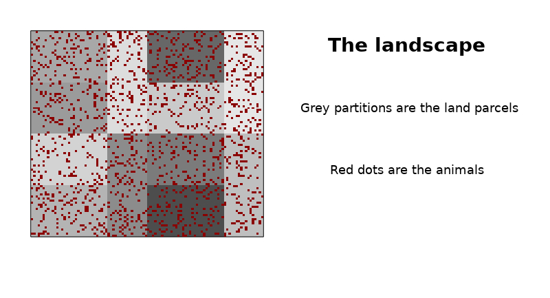

## Welcome to GMSE-GAME!

This game is all about making decisions about sustainable management of animal populations that benefits both conservation and other land uses, such as farming.
  
**In this game, you will play the role of a manager tasked with managing a population of wild animals, which live in a farmland landscape, divided into a number of different farms.** 

Each of these farms is occupied by a landowner who grow crops, which are consumed by the animals - the more animals, the less agricultural yield. 

