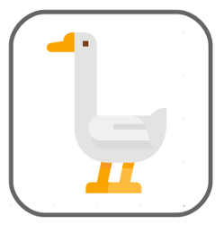
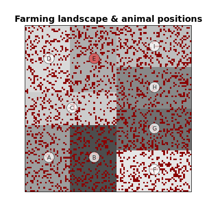

In this game, you play as the manager of a farmland landscape with a population of grazing animals, over a period of 20 years (turns).
The landscape consists of a number of farms (the squares shaded on the landscape) occupied by farmers growing crops.
The grazing animals can negatively affect how well each farm does (decrease yield from the land).

 

 

In each round of the game the farmers decide how to spend their time; they can farm their land, scare animals away, or kill animals by hunting them.
Hunting animals directly removes them from the population, whereas scaring may move them away from a farmer's land. 
Farmers can only take actions on their own land.

Icons made by <a href="https://www.flaticon.com/authors/monkik" title="monkik">monkik</a> from <a href="https://www.flaticon.com/" title="Flaticon">www.flaticon.com</a>

