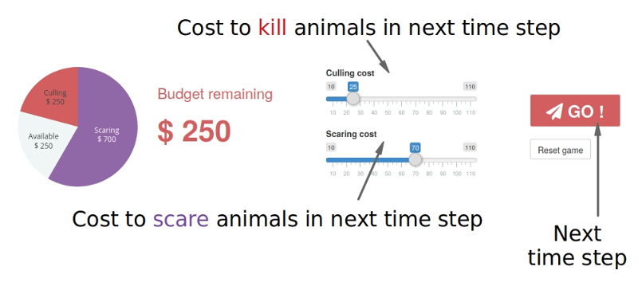

**You influence the animals and farmers by using some of your annual budget to set the cost of two actions the farmers may take in each time step**: either killing some of the animals, or scaring them off their land. 

The higher you set either cost, the fewer actions are likely to be taken. Budget you "spend" on the cost for one action cannot be used for the other, and although you are free not to spend some or all of your budget in each time step, you cannot go over budget and your budget resets in each time step (anything left over does not carry over).

**Once you have made your budget decision, you click "Go!" to go to the next year.**

Instead of killing animals or scaring them, each farmer may also choose to only farm their land - while this increases their yield (and may make up for some yield lost to the feeding animals), it does not affect the animal population.