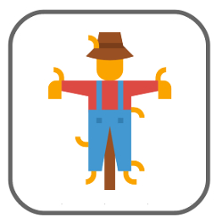
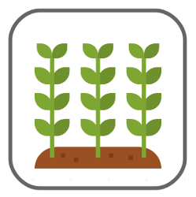

Your aim is to maintain both a number of grazing animals of your choice, as well as the agricultural yield on the landscape.

Although as the manager, you cannot affect the animal population directly, you can influence the decisions the farmers may make each year, by changing the cost of scaring animals or killing animals - for example, this would be through changing to cost of scaring or hunting permits. 

The higher you set the cost of either action, the fewer of those actions are likely to be taken by each farmer.  
You have a fixed budget to allocate to setting the cost of each action; budget invested in one cannot be invested in the other.  
You get the same budget each year. 

Note that you cannot directly change the cost of farming itself, but it is likely that more farming will happen if the cost of other actions are higher than the expected return of farming.

Icons made by <a href="https://www.flaticon.com/authors/monkik" title="monkik">monkik</a> from <a href="https://www.flaticon.com/" title="Flaticon">www.flaticon.com</a>

