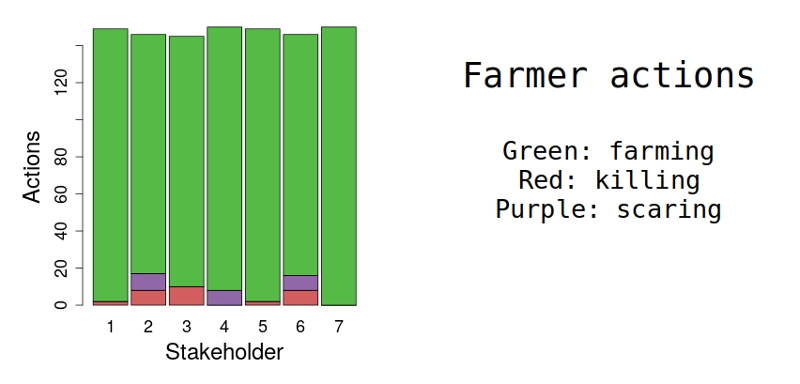

**When you set your costs and clicked "Go!"**, each farmer will make decisions on what to do, depending on how they can best manage their yield, given the costs you have set and the number of animals on their land.  
Their actions are reported for each farmer (stakeholder), with their actions shown in different colours. 

The effect of both your choice of costs, and their choice of actions, can be seen on how both the animal population and agricultural yield changes.