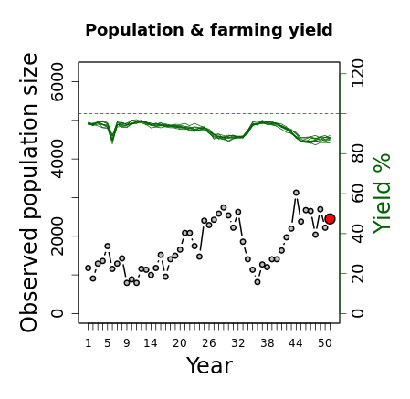

**To help you decide what costs to set for hunting and scaring permits in the following round, you can monitor the state of the environment**.

You can see the population trend of the animal population in the plot below (**black line**) - the red dot is the most recent count, but bear in mind that this count may be inaccurate (you may not have seen all the animals, for example). The animals grow and reproduce at some rate you don't know; so you will have to manage accordingly. 

In the same plot, the relative agricultural yield achieved by each farmer is represented by the **green line**. This is expressed as a percentage of the expected total yield on a farmer's land - anything below 100% means some yield was lost to grazing animals.

