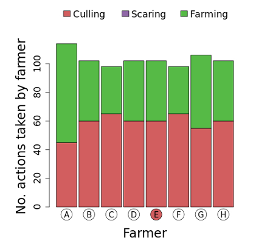

 

**You can also see how many actions were taken by each farmer** in the previous year. This is represented in the barplot below.

Each bar is the count of all actions taken by a single farmer; the different colours represent the three different types of action. If you had set the cost of killing higher in the previous year, you would for example expect to see less killing taking place.

