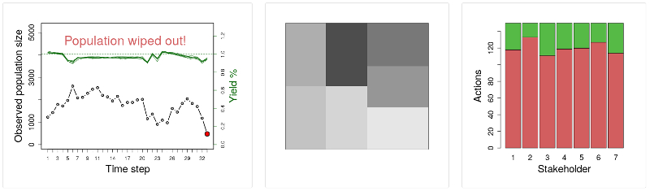

The animals grow and reproduce at some rate you don't know; so you will have to manage accordingly. 

**The game is over when all the animals have died** (the population has gone extinct); or you can choose to end the game at any point.

**You can improve your score in the game** by (1) maintaining a higher population of animals, (2) maintaining a higher yield, and (3) keeping the population from going extinct for longer. We will show your score as well as the top 10 high scores at the end of the game.

You can play as often as you want; have fun!