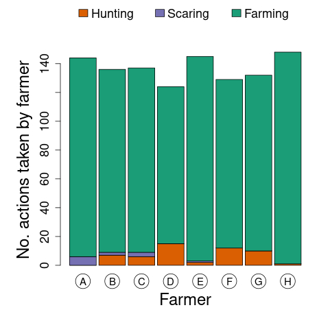

You can also see how many actions were taken by each farmer in the previous year. This is represented in the barplot below.

Each bar is the count of all actions taken by a single farmer; the different colours represent the three different types of action. If you had set the cost of hunting licences higher in the previous year, you would expect to see less hunting taking place, for example.

