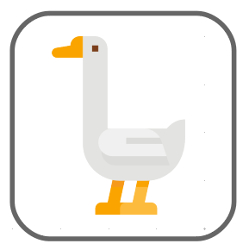

As the number of animals increases, your "biodiversity" score increases, whereas as the agricultural yield increases, your "yield" score increases.
We'll show you how you've done on a leaderboard at the end of each session.

Remember, your aim is to maintain the number of animals and overall agricultural yield of your choice. You have 20 years (turns) to do this in; but **if the population of animals goes extinct it's game over**! Remember to keep an eye on the population and yield trends, and bear in mind that more farmers mean more actions taken!

 

You can play as often as you like - have fun!

Icons made by <a href="https://www.flaticon.com/authors/monkik" title="monkik">monkik</a> from <a href="https://www.flaticon.com/" title="Flaticon">www.flaticon.com</a>

